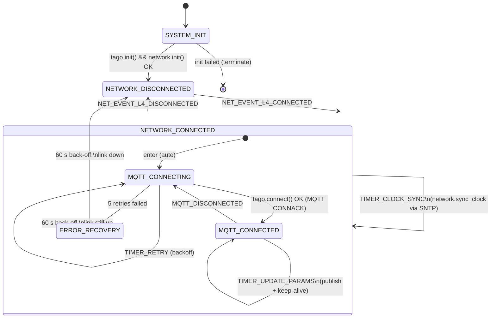

# Cloud State Diagram

The cloud thread is driven by a Zephyr SMF state machine (`cloud.cpp`).
Network connectivity is provided by the on-board WIZnet W5500 Ethernet
controller, which talks to a Sierra Wireless FX30 cellular gateway.  The
PLC sees only a normal DHCP-served Ethernet uplink, so the state machine
has no modem/PPP/AT-chat states; it just reacts to L4 link events from
`net_mgmt` and to MQTT events from the broker.

Notes:
- The old `MODEM_REGISTERED` / `MODEM_DEREGISTERED` events and the
  `modem.restart()` recovery action no longer exist — the FX30 owns the
  cellular link and the PLC has nothing locally to power-cycle.
- The watchdog (configured in the board defconfig) is responsible for
  recovering from CPU lock-ups; the SMF only handles application-level
  retries.
